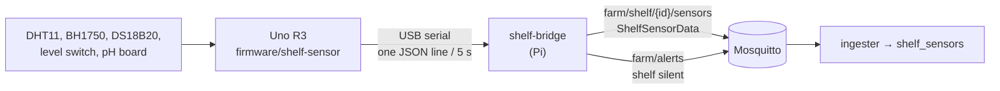

# Shelf sensors

One sensor node watches the shelf's air and hydroponic reservoir. It's an
Arduino Uno R3 on USB to the Pi: no WiFi, no clock, no shelf identity. The
Pi's `shelf-bridge` service gives each reading its shelf, pH and timestamp and
publishes it like any other farm message.



## Hardware

| Part | Measures | `ShelfSensorData` field |
|---|---|---|
| DHT11 module (blue, 3 pins) | Air temperature, humidity | `temperature_c`, `humidity_pct` |
| BH1750 / GY-302 board | Light | `light_lux` |
| DS18B20 steel probe | Reservoir water temperature | `water_temp_c` |
| XKC-Y25 contactless level switch (white disc) | Reservoir above/below a line | `water_level_ok` |
| pH electrode + PH-4502C board | Reservoir pH | `ph` |

Wiring, pins and the serial line format are in
[firmware/shelf-sensor/README.md](../firmware/shelf-sensor/README.md). The
previous team's DS1307 RTC isn't used: the Pi timestamps readings on receipt
(there is no clock sync, by design).

**Mounting**

- **Level switch:** tape or clip it to the outside of the reservoir at the
  lowest acceptable water line. It senses through plastic or glass up to about
  20 mm thick, not through metal.
- **DS18B20 and pH probe:** submerged in the reservoir, away from the pump
  outlet. Never let the pH bulb dry out; store it capped with its storage
  solution.
- **BH1750:** at plant height, facing the grow light.
- **DHT11:** in the canopy air, out of direct light and away from the water.

## Running it on the Pi

1. Flash the Uno once: `cd firmware/shelf-sensor && pio run -t upload`.
2. Plug it into the Pi and find its stable path:
   `ls /dev/serial/by-id/`. Put that path in `port` in
   `farm-controller/shelf-bridge-config.json` (`/dev/ttyACM0` works too, but
   can change if other USB serial devices are added).
3. Let the service user open serial ports: `sudo usermod -aG dialout $USER`,
   then log out and back in.
4. Start it: `npm run shelf`, and watch the output with
   `mosquitto_sub -t 'farm/shelf/#' -v`.

To run it at boot, run it under systemd (the farm-controller README recommends
the same for the orchestrator):

```ini
# /etc/systemd/system/shelf-bridge.service
[Unit]
Description=VerdantOS shelf bridge
Wants=mosquitto.service
After=mosquitto.service

[Service]
User=<pi user>
WorkingDirectory=/home/<pi user>/verdant-os
# Use the path from `which npm` (it differs under nvm)
ExecStart=/usr/bin/npm run shelf
Restart=on-failure
# The bridge exits if the broker isn't up yet; without a delay, systemd's
# start limit (5 restarts in 10 s) would give up on it for good
RestartSec=5

[Install]
WantedBy=multi-user.target
```

### Config (`shelf-bridge-config.json`)

| Key | Meaning |
|---|---|
| `shelves[].shelf_id`, `level` | Identity the readings are published under |
| `shelves[].port` | Serial device of that shelf's node |
| `shelves[].ph_neutral_mv`, `ph_mv_per_unit` | pH calibration (below) |
| `silence_timeout_ms` | No valid reading this long → one alert |
| `reopen_interval_ms` | Retry delay for a missing or dropped port |
| `baud`, `max_line_length`, `watchdog_interval_ms` | Serial and timing settings |

## pH calibration

The bridge converts the board's output with
`pH = 7 + (ph_mv − ph_neutral_mv) / ph_mv_per_unit`, so calibrating is editing
two numbers; the Uno is never reflashed. Stop the bridge first (only one
program can hold the port) and read `ph_mv` with `pio device monitor`.

**Without buffer solutions (offset only, about ±0.5 pH):**

1. Unplug the probe and short the BNC socket's centre pin to its outer shell
   (a paperclip works). That's what the board sees at pH 7.
2. Wait for `ph_mv` to settle and put it in `ph_neutral_mv`.
3. Leave `ph_mv_per_unit` at the typical −175.

**With pH 7 and pH 4 buffers (accurate):**

1. Rinse the probe, put it in pH 7, wait a minute, note `ph_mv` as *mv7*.
2. Rinse, put it in pH 4, wait, note *mv4*.
3. Set `ph_neutral_mv` = *mv7* and `ph_mv_per_unit` = (*mv7* − *mv4*) / 3.
   It comes out negative on this board.

Restart the bridge after editing the config.

## What happens when things fail

| Failure | Node | Bridge / data |
|---|---|---|
| One sensor unplugged or dead | Logs `# <sensor> failed` once, prints `null` for it | Publishes `null`; other readings unaffected |
| pH board or probe unplugged | Reports whatever A0 floats to | pH outside 0–14 becomes `null` |
| Level switch unplugged | The pull-down reads it as "low" | `water_level_ok: false`, the safe direction |
| Light sensor reset by a power glitch | Re-sends its mode every report, so at most one wrong reading | — |
| Node hangs (I2C, firmware bug) | Watchdog resets it within 8 s | Logs the restart (`seq` went back) |
| Port open but silent (node hung past its watchdog, wedged USB) | Reset by the reopen (DTR) | After 20 s closes and reopens the port, and keeps doing so every 20 s until readings return |
| USB unplugged / node rebooting | — | Reopens the port every 3 s; one alert after 20 s of silence, logs when readings resume |
| Pi reboots or loses power | Powered by the Pi's USB, so it restarts with it | systemd starts the bridge; it waits for the port and broker, readings resume within about 10 s |
| Pi clock jumps (no RTC; NTP syncs late or never) | — | Silence is timed on a monotonic clock, so no false alerts; published `timestamp` follows the Pi's clock like every other service |
| Garbage, partial or library error lines | — | Never published; non-JSON lines are logged as node output, repeats once |
| Broker down | — | The shared MQTT client reconnects and sends readings queued while it was offline |

The dashboard doesn't show shelf data yet: it still reads the old Supabase
`sensor_events` table, which nothing writes to since the laptop serial bridge
was retired. Moving it onto shelf data belongs to the dashboard data-flow work.
