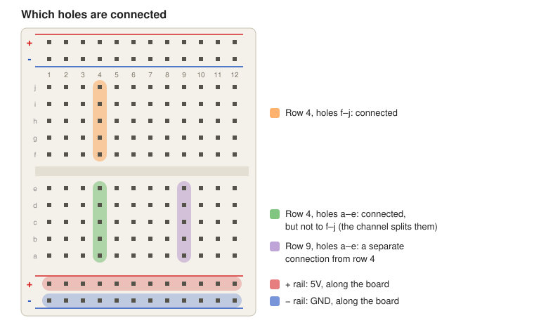

# Wiring

How the farm's boards are wired, and why. Read this page once. After that, each
board's page has its diagram and a check for each sensor.

| Board | Page |
|---|---|
| Shelf sensor node (Arduino Uno R3) | [shelf-sensor.md](shelf-sensor.md) |
| Robot (ESP32-S3) | [robot.md](robot.md) |

Breadboards come first, so wiring can change while we test. Once a layout
works, it moves onto a half-size Perma-Proto perfboard, wired the same way;
each board's page covers both.

## Breadboards



- **Each numbered row has two strips of five holes: a–e and f–j.** The five
  holes of a strip are connected to each other. Plug a sensor's pin into a
  strip, and every other hole of that strip is now that pin.
- **The middle channel separates the two strips.** A row's a–e holes are not
  connected to its f–j holes.
- **The long lines along each edge are the power rails.** Each one is connected
  along the board's whole length. The rail by the red line (+) carries 5V; the
  one by the blue line (−) is GND (ground, 0V).
- **On some full-size boards, each rail is split halfway along**, so the two
  halves aren't connected. The shelf layout stays in rows 1–30, so it doesn't
  matter there; the robot layout shows two bridge jumpers for it. If you use
  the far half, bridge the gap with a jumper.
- **Keep the USB cable unplugged while you change wiring.** One wrong jumper
  between 5V and GND shorts the Uno's power supply.

## Pull-up and pull-down resistors

A **digital input** (D2, D3, …) reads HIGH (near 5V) or LOW (near 0V). It
measures only; it never sets the voltage itself. If nothing connected to it
sets the voltage either, the pin is **floating**, and it reads random HIGHs
and LOWs from electrical noise.

A resistor from the pin to 5V (a **pull-up**) or to GND (a **pull-down**)
gives the pin a default. A sensor that actively drives the line overrides the
default easily, because the resistor only lets a small current through.

### How to tell whether a pin needs one

Look up how the sensor drives its output, in its datasheet or the module's
product page:

| The output… | Datasheet words | Resistor |
|---|---|---|
| Can only pull the line LOW, never HIGH | "open-drain", "open-collector", "NPN output", "1-Wire", "I2C" | **Pull-up**, or the line can never read HIGH |
| Drives both HIGH and LOW | "push-pull", "high level = VCC, low level = 0V" | None needed. Add a **pull-down** (or pull-up) only to choose what the pin reads while the sensor is unplugged |
| Is a varying voltage (analog) | "analog output" | None. Wire it straight to an analog pin (A0–A5) |

Then check the module itself: many breakout boards already have the pull-up
on them (a small resistor next to the pins), so you don't add another.

### Choosing the value

Ohm's law, current = voltage ÷ resistance, decides it:

- **Too small**, and a lot of current flows whenever the line is pulled the
  other way, more than a sensor can handle. 100 Ω from 5V is 50 mA.
- **Too large**, and the resistor is too weak to hold the line steady against
  noise, or to pull it back up quickly after each pulse. 1 MΩ is 0.005 mA.
- **The datasheet usually names a value.** Without one, 10 kΩ (0.5 mA at 5V)
  is the usual default for a pin that changes slowly, such as a switch or a
  level sensor.

### Reading a resistor

The colour bands encode the value. Read from the end where the bands are
bunched together; the gold or silver band (the tolerance) goes on the right.

| Colour | black | brown | red | orange | yellow | green | blue | violet | grey | white |
|---|---|---|---|---|---|---|---|---|---|---|
| Digit | 0 | 1 | 2 | 3 | 4 | 5 | 6 | 7 | 8 | 9 |

- **4 bands**: digit, digit, number of zeros, tolerance. Yellow (4),
  violet (7), red (2 zeros) is 4 700 Ω = 4.7 kΩ.
- **5 bands**: digit, digit, digit, number of zeros, tolerance. Yellow (4),
  violet (7), black (0), brown (1 zero) is 4.7 kΩ, with a brown tolerance band.

The colours are hard to tell apart in poor light. If you have a multimeter,
measure the resistor on its Ω setting before you plug it in.

## Changing a diagram

Each board's diagrams are SVGs drawn by small Python scripts next to them,
with no packages to install (`wiring_svg.py` holds their shared drawing
helpers). Change the rows or pins in the script, not in the SVG, then redraw
it from this folder. For example:

```bash
python3 draw_shelf_sensor.py > shelf-sensor-breadboard.svg
python3 draw_shelf_sensor_perfboard.py > shelf-sensor-perfboard.svg
python3 draw_robot_power.py > robot-power.svg
python3 draw_robot_breadboard.py > robot-breadboard.svg
python3 draw_robot_perfboard.py > robot-perfboard.svg
```

Then update that board's page to match. The pin numbers come from the
firmware's `config.h`; change those together.
