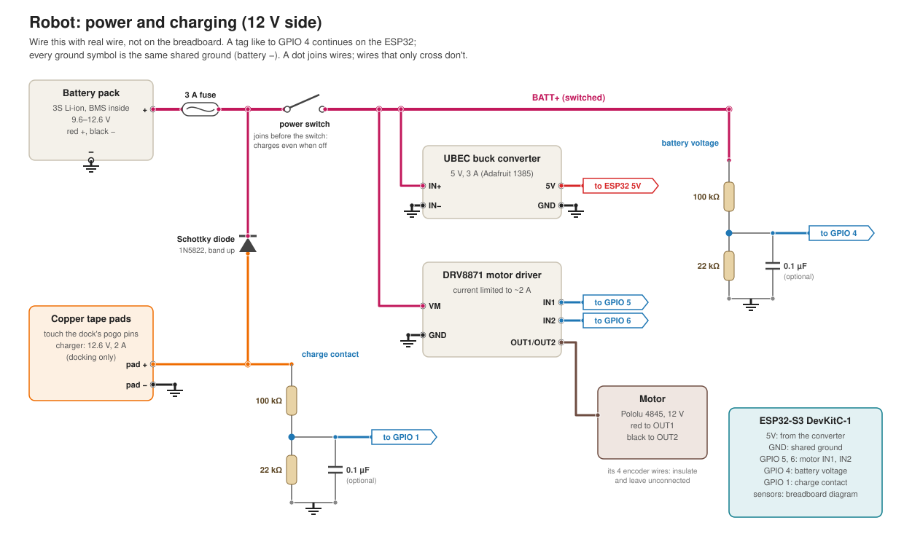
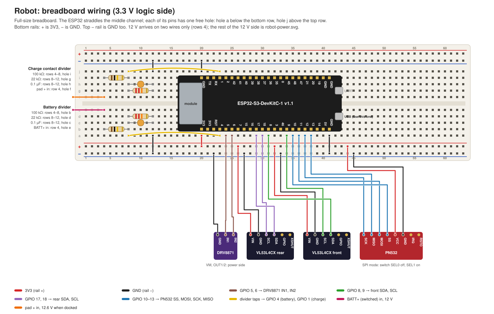
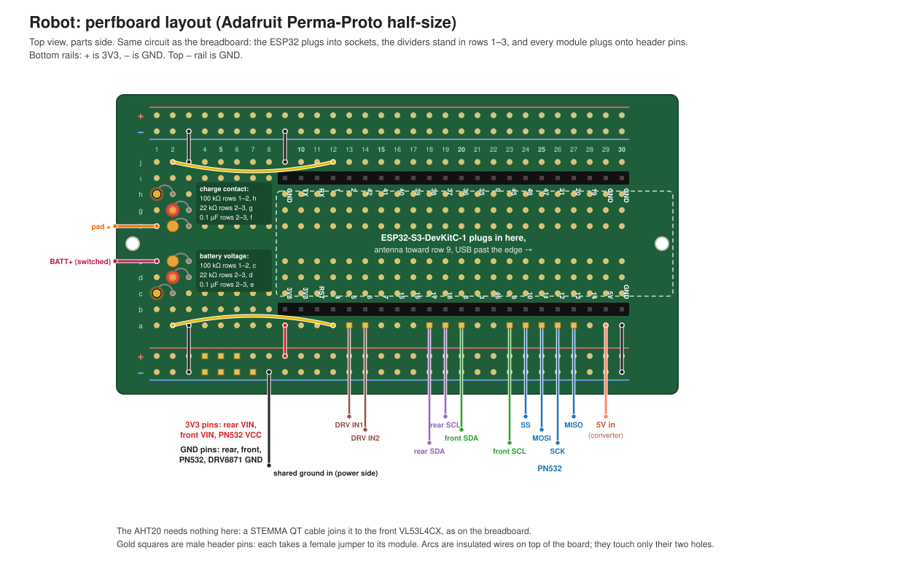

# Wiring — robot (ESP32-S3)

The robot's electronics in three diagrams: the 12 V power side, the 3.3 V
logic side on a breadboard, and the same logic side soldered onto a perfboard.
If you haven't read [README.md](README.md) yet, start there: it covers how a
breadboard is connected inside and what pull-up and pull-down resistors are.
The pins come from `firmware/esp32/src/config.h`; the firmware is in
[firmware/esp32](../../firmware/esp32).

## Parts

| Part | Does | Notes |
|---|---|---|
| ESP32-S3-DevKitC-1 v1.1 (Espressif) | Runs the firmware | Use the port marked **USB** |
| Elechouse PN532 NFC Module V3 | Reads the RFID tags at each node | SPI mode: switch **SEL0 off, SEL1 on** |
| 2× Adafruit VL53L4CX ToF ([5425](https://www.adafruit.com/product/5425)) | Front and rear obstacle distance | Each on its own I2C bus (they share one address) |
| AHT20 breakout with STEMMA QT, e.g. Adafruit [4566](https://www.adafruit.com/product/4566) | Air temperature and humidity, for the dashboard | Joins the rear VL53L4CX's bus |
| Adafruit DRV8871 ([3190](https://www.adafruit.com/product/3190)) | Drives the motor | Limits motor current to about 2 A |
| Pololu 47:1 gearmotor, 12 V ([4845](https://www.pololu.com/product/4845)) | Moves the robot | 0.3 A free-running, about 5 A if stalled |
| UBEC buck converter, 5 V 3 A ([1385](https://www.adafruit.com/product/1385)) | Powers the ESP32 from the battery | Fixed 5 V, nothing to adjust |
| 3S Li-ion pack, 10.8 V 6 Ah, BMS inside | Power | 12.6 V full, 9.6 V empty |
| Two copper tape pads + wires | Touch the dock's two pogo pins | The dock charger gives 12.6 V, 2 A |
| 1N5822 Schottky diode (3 A, 40 V) | Charging path | Keeps the pads dead off the dock |
| 3 A fuse in an inline holder | Battery protection | |
| Power switch, rated 3 A DC or more | Turns the robot off | |
| 2× 100 kΩ, 2× 22 kΩ resistors | The two voltage dividers | |
| 2× 0.1 µF ceramic capacitors | Steady the divider readings | |
| STEMMA QT cable | Rear VL53L4CX → AHT20 | |
| Jumper wires; 20–22 AWG wire for the 12 V side | | |

## ESP32 pins

| ESP32 pin | Goes to |
|---|---|
| **3V3** | 3.3 V for the PN532, both VL53L4CX and the AHT20 (VCC / VIN) |
| **GND** | Ground, shared with everything |
| **5V** | The buck converter's 5 V output (on the robot; on the bench, USB powers it) |
| **GPIO 12 / 13 / 11 / 10** | PN532 SCK / MISO / MOSI / SS |
| **GPIO 8 / 9** | Front VL53L4CX SDA / SCL (`Wire`) |
| **GPIO 17 / 18** | Rear VL53L4CX SDA / SCL (`Wire1`), and the AHT20 through it |
| **GPIO 5 / 6** | DRV8871 IN1 / IN2 |
| **GPIO 4** | Battery divider tap (battery voltage) |
| **GPIO 1** | Charge contact divider tap |
| GPIO 38 | The on-board status LED; nothing to wire |

GPIO 4 and 1 are ADC1 pins, the only ones that can still read a voltage while
WiFi is on. Leave alone: GPIO 0, 3, 45, 46 (they decide how the chip boots),
19/20 (USB) and 43/44 (UART0).

## Power and charging (12 V side)



Wire this side with real wire, not on the breadboard. A tag like **to GPIO 4**
continues on the ESP32, and every ground symbol is the same shared ground.

- **Fuse, then switch.** The fuse sits right at the battery's + wire, so a
  short anywhere after it blows the fuse instead of damaging the pack or the
  wiring. The switch turns everything after it off.
- **Buck converter → ESP32 5V pin.** It turns 9.6–12.6 V into a steady 5 V; the
  DevKit makes its own 3.3 V from that. Both of the converter's black wires go
  to ground. Its label says "7–12 V input" and a full pack is 12.6 V; the chip
  inside is rated well above that, so it's fine, but don't feed it more than
  the pack.
- **DRV8871 → motor.** VM takes the battery after the switch. GPIO 5 and 6
  drive IN1 and IN2: one held low while the other is switched on and off
  rapidly (PWM) sets direction and speed. Both inputs have pull-downs inside
  the chip, so the motor stays off while the ESP32 boots. Its ~2 A limit also
  protects a jammed motor. If the robot drives the wrong way, swap the motor's
  red and black wires. The motor's other four wires are an encoder the
  firmware doesn't use: insulate them and leave them unconnected.
- **Shared ground.** Battery −, pad −, the converter, the driver, the ESP32
  and both dividers all join. Signals only mean something relative to a
  shared ground.

### Charging: pads, diode, charge contact

The dock has two pogo pins wired to its charger (12.6 V, 2 A): one +, one −.
The robot has two copper tape pads that land on them.

- **Pad −** goes straight to ground.
- **Pad +** goes through the **Schottky diode** to the battery side of the
  switch (between the fuse and the switch), so the robot charges even while
  switched off. The diode's band (cathode) faces the fuse.

**Why the diode, when the pack already has a BMS?** The BMS protects the cells
(overcharge, over-discharge, a hard short) but its output is live whenever the
pack isn't faulted. Wired straight to the pads, they'd carry 10–12.6 V all the
time, and the danger here isn't a hard short but a wet one: a splash or
condensation bridging the pads lets only milliamps through, far too little for
the BMS to notice, while the copper corrodes and the pack drains. The diode
only lets current flow *into* the battery, so off the dock the pads are dead.
It also blocks a charger wired backwards.

The diode costs about 0.4 V, so the 12.6 V charger fills the pack to about
4.1 V a cell instead of 4.2 V. The firmware and the orchestrator call charging
complete at **85%** (`CHARGE_COMPLETE_PCT`, `charge_complete_pct`) for that
reason.

### The two voltage dividers

The ESP32 can only read up to about 3.1 V, so each 12 V signal goes through
two resistors that scale it down: `V_pin = V_in × 22k / (100k + 22k)`, about
0.18 of the input.

| Divider | In | Out | Pin |
|---|---|---|---|
| **Battery** | BATT+ after the switch: 9.6–12.6 V | 1.73–2.27 V | GPIO 4 |
| **Charge contact** | Pad +: 12.6 V docked, nothing off the dock | About 2.3 V docked, 0 V off | GPIO 1 |

- **Why 22 kΩ, not 33 kΩ:** 33 kΩ put a full pack at 3.13 V, the edge of what
  the ADC can read. 22 kΩ leaves headroom (`BATTERY_R2_OHMS` in `config.h`).
- **Why so large:** 122 kΩ in total lets only 0.1 mA through, so the dividers
  barely drain the battery. The battery divider sits after the switch, so a
  switched-off robot doesn't drain at all.
- **The 0.1 µF capacitor** across each 22 kΩ steadies the reading: the ADC
  takes a quick gulp of charge each time it samples, and through 100 kΩ the
  pin can't refill fast enough without it.
- **Off the dock**, the charge contact divider's 22 kΩ is also its pull-down:
  it holds GPIO 1 at 0 V instead of letting it float.

## Breadboard (3.3 V logic side)



The DevKit straddles the middle channel of a full-size breadboard with its
antenna toward row 20 and its pins in rows 20–41: the bottom row (J1) in hole
b, the top row (J3) in hole i. That leaves **one free hole per pin**: a below,
j above. 12 V reaches the breadboard on two wires only, each landing on a
100 kΩ resistor in row 4.

| Where | What |
|---|---|
| Row 20, hole a → bottom + rail | 3V3: the bottom + rail is 3.3 V |
| Row 41, hole a → bottom − rail; row 20, hole j → top − rail | GND on both − rails |
| Rows 4–12, bottom half | Battery divider: BATT+ in at row 4 hole e; 100 kΩ rows 4–8 (hole b); 22 kΩ rows 8–12 (hole d); 0.1 µF rows 8–12 (hole c); row 8 hole a → row 23 hole a (GPIO 4); row 12 hole a → − rail |
| Rows 4–12, top half | Charge contact divider: pad + in at row 4 hole f; 100 kΩ rows 4–8 (hole i); 22 kΩ rows 8–12 (hole g); 0.1 µF rows 8–12 (hole h); row 8 hole j → row 23 hole j (GPIO 1); row 12 hole j → top − rail |
| DRV8871 | IN1 ← row 24 hole a (GPIO 5), IN2 ← row 25 (GPIO 6), GND ← − rail |
| VL53L4CX rear | SDA ← row 29 (GPIO 17), SCL ← row 30 (GPIO 18), VIN ← + rail, GND ← − rail |
| VL53L4CX front | SDA ← row 31 (GPIO 8), SCL ← row 34 (GPIO 9), VIN ← + rail, GND ← − rail |
| AHT20 | STEMMA QT cable from the rear VL53L4CX's second port: it carries 3V3, GND, SDA and SCL |
| PN532 | SS ← row 35 (GPIO 10), MOSI ← row 36 (GPIO 11), SCK ← row 37 (GPIO 12), MISO ← row 38 (GPIO 13), VCC ← + rail, GND ← − rail |

The modules connect with jumper wires; leave each VL53L4CX's GPIO and XSHUT
pins and the PN532's IRQ and RSTO unconnected. The DRV8871's labels may not
be in the order drawn: go by the names printed next to its pins.

### Why the modules need no resistors

- **VL53L4CX:** I2C lines need pull-up resistors, and Adafruit's board has
  them, along with its own regulator ("VLogic/Vcc 3–5VDC"). The two sensors
  share one fixed address, which is why each has its own bus.
- **AHT20:** it shares the rear VL53L4CX's bus, which works because the two
  answer to different addresses (0x38 and 0x29). Its board has pull-ups
  too; two boards' pull-ups side by side are still well within what
  I2C allows. The cable powers it from 3V3, so its pull-ups pull to 3.3 V, as
  the ESP32's pins need.
- **PN532:** SPI lines are driven both ways by the chips, so they need none.
- **DRV8871:** its inputs have pull-downs built in.

## Before you power it

- **Battery polarity and the diode's direction.** The band faces the fuse.
- **No 12 V near 3.3 V.** BATT+ and pad + touch only their 100 kΩ resistors
  and the power side.
- **The rails.** With a multimeter on Ω, + and − must not read near 0 Ω.
- **The PN532's switches:** SEL0 off, SEL1 on (SPI).
- **USB and the converter together are fine** on this genuine Espressif board:
  a diode on its 5V pin keeps them apart. Clone boards may lack it.

## Bring it up one part at a time

Flash the bench firmware (sensors and comms, no motor) and watch the serial
monitor and the broker
([COMMS-SENSOR.md](../../firmware/esp32/COMMS-SENSOR.md#running-the-bench-test)):

```bash
cd firmware/esp32
pio run -e bench -t upload && pio device monitor -e bench
```

On the bench, USB powers the ESP32. Unplug it before adding each part:

| Add | Then check |
|---|---|
| The ESP32 alone | Boots, joins WiFi, sends telemetry once a second |
| PN532 | The monitor prints its firmware version; a tag held to it prints its UID |
| Front VL53L4CX | "front VL53L4CX ready"; a hand within 15 cm prints "obstacle flag SET", away past 20 cm "cleared" |
| Rear VL53L4CX | The same, for "rear" |
| AHT20 | "AHT20 ready"; telemetry carries `temperature_c` and `humidity_pct`, and breathing on it raises the humidity |
| Battery divider (+ the power side) | With a multimeter, GPIO 4 reads 0.18 × the pack voltage; `battery_pct` in telemetry matches the pack. Tune `BATTERY_CAL_FACTOR` if it's off |
| Charge contact divider | Pads on the dock: GPIO 1 reads about 2.3 V; off the dock, 0 V |
| DRV8871 + motor | The motor task is still a placeholder: test the driver with a standalone sketch (IN1 switched on and off, IN2 low, then swapped) before the motor task is written |

## Moving to the perfboard



The same circuit on an
[Adafruit Perma-Proto half-sized board](https://www.adafruit.com/product/1609)
(30 rows, wired like half a breadboard). The DevKit plugs into two 1×22 female
header sockets in rows 9–30, so it can be swapped, with its USB end past the
board's edge so the cable still plugs in. The dividers stand on end in rows
1–3, away from the antenna end.

| Where | What |
|---|---|
| Rows 9–30, holes b and i | The DevKit's two sockets (J1 in b, J3 in i) |
| Row 9 hole a → + rail; row 30 hole a → − rail; row 9 hole j → top − rail | 3V3 and GND, as on the breadboard |
| Rows 1–3, bottom half | Battery divider: BATT+ wire into row 1 hole e; 100 kΩ rows 1–2 (hole c); 22 kΩ and 0.1 µF rows 2–3 (holes d, e); row 2 hole a → row 12 hole a (GPIO 4); row 3 hole a → − rail |
| Rows 1–3, top half | Charge contact divider: pad + wire into row 1 hole f; 100 kΩ rows 1–2 (hole h); 22 kΩ and 0.1 µF rows 2–3 (holes g, f); row 2 hole j → row 12 hole j (GPIO 1); row 3 hole j → top − rail |
| Male header pins, hole a | Row 13 (GPIO 5), 14 (GPIO 6), 18 (GPIO 17), 19 (GPIO 18), 20 (GPIO 8), 23 (GPIO 9), 24 (GPIO 10), 25 (GPIO 11), 26 (GPIO 12), 27 (GPIO 13) |
| Male header pins on the rails | + rail rows 4–6 (3V3 for the three modules), − rail rows 4–7 (their GND and the DRV8871's) |
| Wires in | The converter's 5 V into row 29 hole a (the DevKit's 5V); the shared ground onto the − rail |

Extra parts: the board, two 1×22 female header sockets, a strip of male
header pins, insulated wire for the links, and female jumper wires to the
modules (or, for the VL53L4CX, STEMMA QT to female socket cables). The AHT20
needs nothing on the board: it stays on its cable from the rear VL53L4CX.

Solder in this order: the links and the standing resistors and capacitors,
then the sockets and pins. Before plugging the DevKit in, check with a
multimeter: the rails don't read near 0 Ω between + and −, rows 1 and 2 read
about 100 kΩ, rows 2 and 3 about 22 kΩ (in parallel with the capacitor, it
settles there), and no neighbouring rows are joined by solder. Then repeat
[Before you power it](#before-you-power-it) and the bring-up checks.
