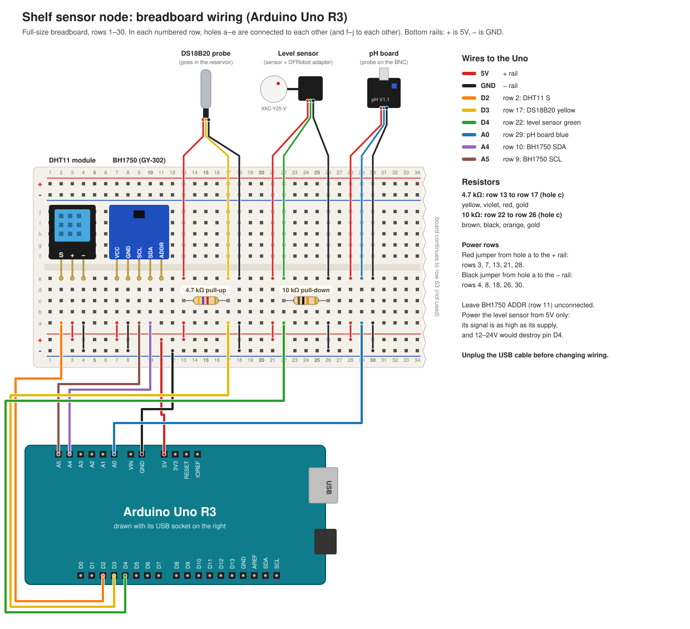
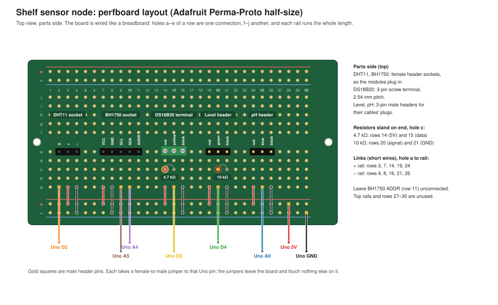

# Wiring — shelf sensor node (Arduino Uno R3)

The shelf node on a full-size breadboard, then soldered onto a perfboard
([Moving to the perfboard](#moving-to-the-perfboard)). If you haven't read
[README.md](README.md) yet, start there: it covers how a breadboard is
connected inside and what the resistors are for. What the node does is in
[shelf-sensors.md](../shelf-sensors.md); its firmware is in
[firmware/shelf-sensor](../../firmware/shelf-sensor).



## Parts

| Part | Measures | Connects with |
|---|---|---|
| DHT11 module (blue sensor on a black board, 3 pins) | Air temperature, humidity | Pins straight into the breadboard |
| BH1750 board (GY-302, blue, 5 pins) | Light | Pins straight into the breadboard |
| DS18B20 steel probe | Water temperature | Bare wires: red, yellow, black |
| DFRobot liquid level kit: XKC-Y25-V sensor (white disc) on its adapter board | Water above or below a line | Cable from the adapter: red, green, black |
| DFRobot pH meter V1.1 board, with its probe on the BNC socket | pH | Cable from the board: red, blue, black |
| 4.7 kΩ resistor (yellow, violet, red) | | |
| 10 kΩ resistor (brown, black, orange) | | |
| Jumper wires, male to male | | |

The two DFRobot cables end in a 3-pin plug. If yours is a female header,
push male-to-male jumpers into it. The DS18B20's bare wires are stiff
enough to push into a hole; if one keeps falling out, twist its strands
together or solder a header pin onto it.

## Connections

Every sensor pin goes into **hole e** of its own row. Then each row gets one
wire from **hole a**: to the + rail, the − rail, or an Uno pin. The bottom
rails carry the power: Uno **5V to the + rail, Uno GND to the − rail**.

| Row | Sensor pin or wire | Hole a goes to | Why |
|---|---|---|---|
| 2 | DHT11 **S** | Uno **D2** | Data |
| 3 | DHT11 **+** | + rail | 5V |
| 4 | DHT11 **−** | − rail | GND |
| 7 | BH1750 **VCC** | + rail | 5V; the board makes its own 3.3V |
| 8 | BH1750 **GND** | − rail | |
| 9 | BH1750 **SCL** | Uno **A5** | I2C clock. A5 is the Uno's I2C clock pin |
| 10 | BH1750 **SDA** | Uno **A4** | I2C data. A4 is the Uno's I2C data pin |
| 11 | BH1750 **ADDR** | nothing | Unconnected sets I2C address 0x23, which the firmware expects |
| 13 | DS18B20 **red** | + rail | 5V |
| 17 | DS18B20 **yellow** | Uno **D3** | Data |
| 18 | DS18B20 **black** | − rail | |
| 21 | Level adapter **red** | + rail | 5V. Never more (below) |
| 22 | Level adapter **green** | Uno **D4** | HIGH = water |
| 26 | Level adapter **black** | − rail | |
| 28 | pH board **red** | + rail | 5V |
| 29 | pH board **blue** | Uno **A0** | Analog voltage |
| 30 | pH board **black** | − rail | |

**Resistors**, each lying across hole c of two rows:

| Resistor | Between | Job |
|---|---|---|
| 4.7 kΩ | row 13 (5V) and row 17 (DS18B20 data) | Pull-up for the DS18B20 |
| 10 kΩ | row 22 (level signal) and row 26 (GND) | Pull-down for the level sensor |

On the Uno, 5V, GND, A0, A4 and A5 are on the header by the "POWER" and
"ANALOG IN" labels; D2, D3 and D4 are on the "DIGITAL" header across the board.
The diagram draws the Uno with its USB socket on the right so that both
headers face the wires.

## Why each sensor does or doesn't get a resistor

Following [the rules in README.md](README.md#how-to-tell-whether-a-pin-needs-one):

- **DS18B20: 4.7 kΩ pull-up.** It talks over a 1-Wire bus, where the sensor
  can only pull the data line LOW; something else must pull it back HIGH
  between bits. Its datasheet asks for about 5 kΩ to the supply, and 4.7 kΩ is
  the standard value. Without it the firmware reports `water_temp_c: null`.
- **Level sensor: 10 kΩ pull-down.** The adapter drives its output both ways:
  HIGH (equal to its supply voltage) with water, 0V without. So it needs no
  resistor to work. The pull-down decides what D4 reads if the sensor is
  unplugged or its wire breaks: LOW, which the firmware reports as "water
  low". A broken sensor then raises the alarm instead of hiding a dry
  reservoir. At 5V, 10 kΩ lets 0.5 mA through; the adapter can supply up to
  50 mA.
- **DHT11: none to add.** Its data line also needs a pull-up, but the module
  has one on its board. A bare 4-pin DHT11, without the board, would need its
  own.
- **BH1750: none to add.** I2C lines need pull-ups too, and the GY-302 board
  has them.
- **pH board: none.** Its output is an analog voltage, driven by the board, and
  read by an analog pin.

**Never power the level sensor from 12V or 24V.** The sensor itself accepts
5–24V, but its HIGH output is as high as its supply, and more than 5V on D4
destroys the pin.

## Before you plug in the USB cable

These are the mistakes that can damage a part. Check them every time you
change the wiring:

- **DHT11 pin order.** Most of these modules are S, +, − from left to right,
  but some aren't. Go by the letters printed next to its pins: 5V on its −
  pin can destroy it.
- **BH1750 regulator.** The bare BH1750 chip is rated to 4.5V at most. The
  GY-302 board runs it from 5V through its own 3.3V regulator, a small 3-pin
  chip on the board. If yours has none, don't wire it to 5V: it would need
  3.3V and a level shifter.
- **Rails.** No wire or resistor joins the + rail to the − rail. With a
  multimeter on Ω, the two rails should not read near 0 Ω.
- **Level sensor supply.** Its red wire goes to the + rail (5V), never to a
  12–24V supply.
- **Wire colours.** DS18B20 probes from other sellers can have white or blue
  data wires. Red is 5V and black is GND on all of them.

## Bring it up one sensor at a time

Flash the firmware and open the serial monitor (Mac, Linux or the Pi):

```bash
cd firmware/shelf-sensor
pio run -t upload
pio device monitor
```

A line appears every 5 s. With no sensors connected, most readings are `null`,
the level and pH readings are random (their pins are floating), and the
BH1750 library prints `[BH1750] ERROR` lines. That's expected.
Unplug the USB cable, add one sensor (its rows, rail jumpers and resistor),
plug back in, and check it before adding the next:

| Add | Then check |
|---|---|
| The two Uno power wires to the rails | Nothing changes |
| DHT11 | `temperature_c` and `humidity_pct` have values. Breathe on it: humidity rises |
| BH1750 | `light_lux` has a value. Cover it: it falls near 0 |
| DS18B20 + 4.7 kΩ | `water_temp_c` has a value. Hold the probe: it rises |
| Level sensor + 10 kΩ | `water_level_ok` is `false`. Hold the white disc flat against a plastic bottle of water: on the next line it's `true` |
| pH board | With the probe unplugged, touch the BNC socket's centre pin to its outer shell with a paperclip: `ph_mv` settles at about 2000, what the board outputs at pH 7 |

When a sensor reads `null` or never changes, unplug the USB cable and check
its rows against the table above: the wrong row is the usual cause. A sensor
that goes `null` logs `# <name> failed` once, and `# <name> ok` when it
recovers, so you can wiggle wires while watching the monitor.

Then calibrate pH: [shelf-sensors.md](../shelf-sensors.md#ph-calibration).

## Moving to the perfboard

Once the breadboard works, solder it onto an
[Adafruit Perma-Proto half-sized board](https://www.adafruit.com/product/1609).
Its copper is laid out like half a breadboard: 30 rows, each with two 5-hole
strips (a–e and f–j), and four power rails that run the whole length. So the
circuit stays the same. Only the layout changes, so that every sensor plugs
in and can be swapped without desoldering.



### Extra parts

| Part | For |
|---|---|
| Adafruit Perma-Proto half-sized board | The board |
| Female header sockets, 1×3 and 1×5 | DHT11 and BH1750 modules plug in |
| 3-pin screw terminal, 2.54 mm (0.1") pitch | DS18B20's bare wires. 3.5 mm and 5 mm terminals don't fit three neighbouring rows |
| Male header pins (a 1×40 strip, snapped apart) | Two 1×3 for the level and pH cables, and 8 single pins for the Uno |
| Solid-core wire, about 22 AWG | The 10 short links to the rails |
| 8 female-to-male jumper wires | Perfboard to Uno |

Plus the 4.7 kΩ and 10 kΩ resistors from the breadboard.

### What moves

- **Each cable's three wires are in neighbouring rows,** so one connector takes
  them all. On the breadboard they were spread out (e.g. DS18B20 in rows 13,
  17 and 18).
- **Each resistor stands on end** between two neighbouring rows: one lead
  straight down, the other bent back along its body. The pull-up sits between
  the DS18B20's 5V and data rows, the pull-down between the level sensor's
  signal and GND rows. They do exactly what they did on the breadboard.
- **The Uno connects through male header pins:** one in hole a of each signal
  row, and one on each bottom rail for 5V and GND. A female-to-male jumper
  goes from each pin to the Uno.

| Row | Hole e (the part) | Hole a |
|---|---|---|
| 2 | DHT11 **S** | Pin → Uno **D2** |
| 3 | DHT11 **+** | Link to + rail |
| 4 | DHT11 **−** | Link to − rail |
| 7 | BH1750 **VCC** | Link to + rail |
| 8 | BH1750 **GND** | Link to − rail |
| 9 | BH1750 **SCL** | Pin → Uno **A5** |
| 10 | BH1750 **SDA** | Pin → Uno **A4** |
| 11 | BH1750 **ADDR** | Nothing |
| 14 | DS18B20 **red** | Link to + rail |
| 15 | DS18B20 **yellow** | Pin → Uno **D3** |
| 16 | DS18B20 **black** | Link to − rail |
| 19 | Level cable **red** | Link to + rail |
| 20 | Level cable **green** | Pin → Uno **D4** |
| 21 | Level cable **black** | Link to − rail |
| 24 | pH cable **red** | Link to + rail |
| 25 | pH cable **blue** | Pin → Uno **A0** |
| 26 | pH cable **black** | Link to − rail |

The resistors go in hole c: the 4.7 kΩ across rows 14 and 15, the 10 kΩ
across rows 20 and 21. The Uno's 5V and GND pins sit on the bottom + and −
rails (drawn near rows 28 and 30; any hole on the rail works). Use the rails
as they're marked on your board.

### Soldering order

1. **The 10 links,** then **the two resistors.** Lowest parts first, so the
   board lies flat while you solder.
2. **The sockets, headers and terminal.** Solder one pin of each, check the
   part sits straight, then solder the rest.
3. **Check it before anything is plugged in.** With a multimeter on Ω:
   - the + and − rails must not read near 0 Ω;
   - each link must read near 0 Ω from its row to its rail;
   - rows 14 and 15 should read about 4.7 kΩ, and rows 20 and 21 about 10 kΩ;
   - neighbouring rows must not be joined by a stray blob of solder.
4. **Plug in the sensors** with the USB cable unplugged, then repeat
   [Before you plug in the USB cable](#before-you-plug-in-the-usb-cable) and
   [the bring-up checks](#bring-it-up-one-sensor-at-a-time).

Screw the board down through its two mounting holes, and tie the probe
cables to the board or the shelf, so that a tug on a cable doesn't pull on
its connector.
