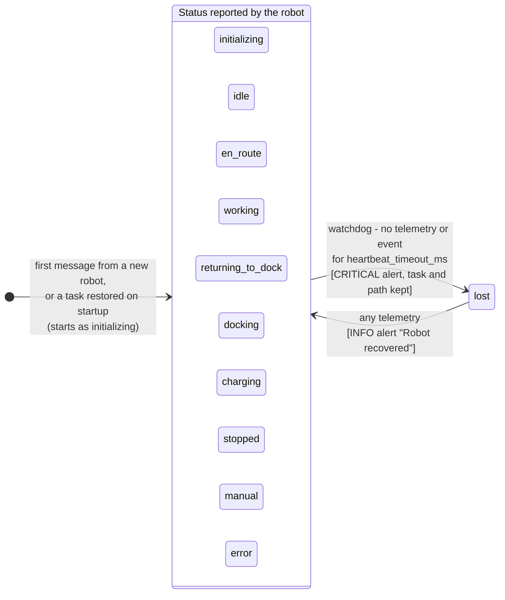
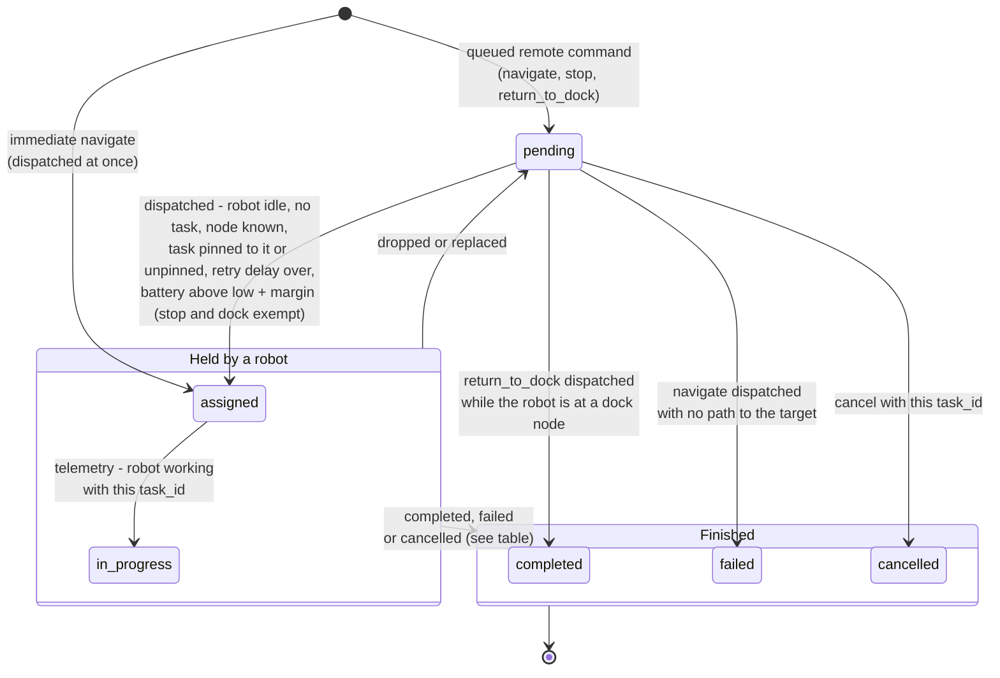

# Orchestrator state machine

How the orchestrator tracks each robot and its tasks, as implemented in
`src/state-machine.ts` and `src/index.ts`. The robot's side of the contract is in
`docs/firmware-architecture.md`.

The robot is the source of truth. The orchestrator does not advance a robot's
status on its own: every status comes from the robot's telemetry, except `lost`,
which the watchdog sets when a robot goes silent. What the orchestrator owns is
the **task lifecycle** and its **reactions** to what the robot reports.

Defaults below are from `orchestrator-config.json`:
`heartbeat_timeout_ms` 30 s, `command_ack_timeout_ms` 5 s, `battery_low_pct` 20,
`battery_assign_margin_pct` 10, `battery_critical_pct` 15, `max_task_retries` 2,
`task_retry_delay_ms` 60 s.

## 1. Robot status as tracked

Inside the box the orchestrator copies `status` from every valid telemetry
message, so any status can follow any other; the robot decides. Events never
change the stored status. Telemetry and events both refresh `last_seen` (Pi
receive time).

### What the orchestrator does in each status

| Status | Assigns queued work | Low-battery `return_to_dock` | Path | Completes an assigned… |
|---|---|---|---|---|
| `idle` | Yes, every telemetry (needs a known node and no assigned task) | Battery ≤ low + margin (30%) | — | — |
| `en_route` | No | Battery ≤ low (20%) | Deviation alerts; entering `en_route` adds the route from the current node | — |
| `working` | No | Battery ≤ low (20%) | — | — |
| `returning_to_dock` | No | No (clears a pending dock request) | Kept | — |
| `docking`, `charging` | No | No (clears a pending dock request) | Kept | dock task |
| `stopped` | No | No | Kept | stop task |
| `manual` | No | No | Dropped (no deviation alerts) | — |
| `error`, `initializing` | No | No | Kept | — |
| `lost` (orchestrator only) | No | No | Kept | — |

The low-battery return is skipped while a stop task is queued or assigned for the
robot, is sent once and only resent if the robot hasn't acted on it within
`command_ack_timeout_ms`, and raises a CRITICAL alert the first time if the
battery is at or below `battery_critical_pct`.

## 2. Task lifecycle

Leaving "Held by a robot" (from `assigned` or `in_progress`):

| To | When |
|---|---|
| `completed` | `task_complete` event with this `task_id`; or telemetry `last_completed_task_id` equals it; or a stop task and the robot reports `stopped`; or a dock task and the robot reports `docking` / `charging` |
| `failed` | `task_failed` event with this `task_id`; or dropped more than `max_task_retries` times |
| `pending` | The robot reports `task_id: null` after `command_ack_timeout_ms` (retry counted; non stop/dock tasks wait `task_retry_delay_ms`); or replaced by an immediate navigate (not counted) |
| `cancelled` | `cancel` (not allowed for stop tasks). The robot is sent `cancel`, and again whenever it still reports the task |

Notes:

- A remote command whose id is already queued, assigned or among the last
  `completed_task_limit` finished tasks is ignored.
- Dispatch picks the first eligible task in priority order (critical, high,
  normal, low; oldest first). Tasks pinned to another robot don't block it.
- The robot keeps its `task_id` through dock trips, `stop`, `error` and `manual`,
  so none of those requeue a task by themselves; only a `null` `task_id` does.
- An immediate navigate goes through the same dispatch, so an immediate
  "charge" (a dock task) at a dock node completes straight away.
- A task becomes `in_progress` the first time the robot reports `working` on it,
  and stays `in_progress` through dock trips and pauses until it finishes. A
  requeue puts it back to `pending`.
- Queued, assigned and finished tasks are saved to `orchestrator-state.json` and
  restored on restart; restored assigned tasks are reconciled by the robot's
  next telemetry.

## 3. Telemetry handling

Runs for every telemetry message, in this order.

```mermaid
flowchart TD
    A[Telemetry on farm/robot/id/telemetry] --> B{Valid payload and<br/>current_node in topology?}
    B -- no --> Z[Drop and log]
    B -- yes --> C[last_seen = receive time]
    C --> D{Status becomes en_route<br/>and task has a target?}
    D -- yes --> E[Add route from current node<br/>to expected path]
    D -- no --> F
    E --> F[Copy status, node, battery, heading]
    F --> G{manual?}
    G -- yes --> H[Drop expected path]
    G -- no --> I
    H --> I{en_route with a path, on a new node<br/>that is not on the path?}
    I -- yes --> J[WARNING alert: deviated]
    I -- no --> K
    J --> K{Was lost?}
    K -- yes --> L[INFO alert: recovered]
    K -- no --> M
    L --> M{Assigned task?}
    M -- no --> Q
    M -- yes --> M2{working on it and<br/>still assigned?}
    M2 -- yes --> M3[Mark in_progress]
    M2 -- no --> N
    M3 --> N{last_completed_task_id matches,<br/>or stop task and stopped,<br/>or dock task and docking/charging?}
    N -- yes --> O[Complete task]
    N -- no --> P{task_id null and<br/>grace period over?}
    P -- yes --> P2[Requeue, or fail after<br/>max_task_retries]
    P -- no --> Q
    O --> Q
    P2 --> Q
    Q{Returning, docking<br/>or charging?} -- yes --> Q2[Clear dock request]
    Q -- no --> R
    Q2 --> R{No stop pending, battery at threshold,<br/>idle / en_route / working?}
    R -- yes --> S{Dock request sent<br/>within grace period?}
    S -- yes --> Y
    S -- no --> T[Send return_to_dock;<br/>CRITICAL alert first time if critical]
    T --> Y
    R -- no --> U{idle?}
    U -- yes --> V[Assign next task]
    U -- no --> Y
    V --> Y{Robot still reports<br/>a cancelled task?}
    Y -- yes --> W[Resend cancel,<br/>at most once per grace period]
    Y -- no --> X[Save tasks, publish<br/>farm/robot/id/state if changed]
    W --> X
```

## 4. Events

Events are a fast path; telemetry corrects anything missed.

| Event | Effect |
|---|---|
| `task_complete` | Only if `task_id` matches the assigned task: complete it, request the next task |
| `task_failed` | Only if `task_id` matches: fail it, WARNING alert, request the next task |
| `error` | CRITICAL alert; task and path kept |
| `recovery` | INFO alert; request the next task |
| `path_blocked` | WARNING alert (while stored status is `en_route`) |
| `charge_complete` | Request the next task (while stored status is `charging`) |
| `arrived`, `task_started`, `dock_connected`, `battery_low`, `battery_critical`, `obstacle_detected` | No effect; status comes from telemetry |

"Request the next task" only assigns one if the stored status is `idle` and the
robot has no assigned task; otherwise the next `idle` telemetry does it.

## 5. Remote commands

From `farm/commands/local` (dashboard on the farm network) and
`farm/commands/remote` (Supabase bridge).

| Command | Handling |
|---|---|
| `navigate` | Unknown target or duplicate id: ignored. Immediate: dispatched now, the current task goes back to the queue. Otherwise: queued, pinned to `robot_id` if given |
| `stop` | Immediate: sent to the robot(s). Otherwise: a stop task per robot (the dashboard sends it as critical), run when the robot is next idle ("pause after the current task") |
| `return_to_dock` | Immediate: sent to the robot(s). Otherwise: a dock task per robot |
| `resume` | Always sent straight to the robot(s); also ends `manual` |
| `cancel` | Needs a `robot_id` or `task_id`. Cancels that queued or assigned task, or the robot's current task, including while `lost`. Refused for an assigned stop task (use `resume`) |
| `jog` | Only from `farm/commands/local` and for a known robot; sent straight to it, never queued |

`immediate` is read from the message or from inside `command`.
