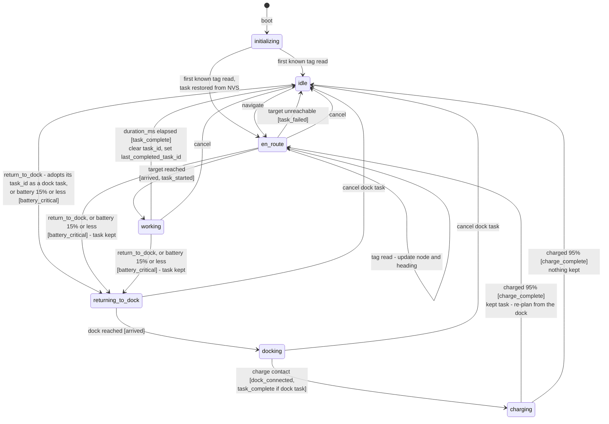
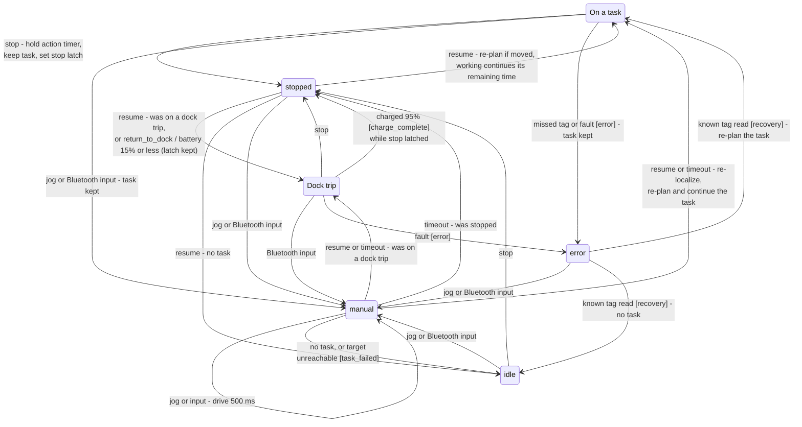

# Robot firmware state machine (intended)

The navigation task's state machine, as specified in
`docs/firmware-architecture.md`. The states are the `status` values the robot
reports in telemetry. The simulator (`farm-controller/simulator`) implements the
same behaviour and is the reference when in doubt.

Events are shown in `[brackets]` and are always pushed **before** the status
changes (single outbound FIFO). Thresholds are the proposed `config.h` values.

## 1. Normal operation

## 2. Interrupts: stop, manual, faults

"On a task" is `en_route` or `working`; "Dock trip" is `returning_to_dock`,
`docking` or `charging`.

## Rules the diagram can't show

- **`navigate`** is accepted in any state after `initializing`. It replaces the
  task, clears the stop latch, paused status and kept task, and goes to
  `en_route`. It is ignored if its `task_id` equals the current task or
  `last_completed_task_id` (a redelivered duplicate).
- **`cancel`** only acts on a matching `task_id`. It clears the task without
  setting `last_completed_task_id` or sending an event. A cancelled task that was
  paused by `stop` leaves the robot `stopped` (it resumes to `idle`). Cancelling a
  task kept during a dock trip leaves the trip running, so the robot still
  charges.
- **`return_to_dock`** is ignored while already returning, docking or charging.
- **`stop`** is accepted in any state after `initializing` (the diagram shows
  the common ones) and ignored when already `stopped`. `resume` returns to the
  paused state, re-planning first if the robot was moved.
- **`resume`** outside `manual` only acts if the stop latch is set. In `manual`
  it also clears the latch.
- **Manual timeout:** each jog or Bluetooth input drives for 500 ms and restarts
  a 5 s timer (`MANUAL_TIMEOUT_MS`); when it runs out the robot leaves manual as
  shown.
- **Stop latch:** set by `stop`, cleared by `resume` or `navigate`. It survives
  dock trips and manual timeouts.
- **`idle` never holds a task:** `task_id` is `null` in `idle`. In every other
  state the robot keeps its `task_id` until the task completes, fails or is
  cancelled.
- **Survival overrides** run before everything else, except that in `manual`
  only the motor cutoff (about 5%) applies:
  - warn at 20% [`battery_low`];
  - forced return at 15% [`battery_critical`], keeping the task and stop latch;
  - motor cutoff at about 5%.
- **Obstacle:** motors hard-stop while the flag is set. The status doesn't
  change. `[obstacle_detected]` is sent once, then `[path_blocked]` if still
  blocked after a timeout.
- **Telemetry** is sent every 1 s and on every status or node change, and always
  reports the current `task_id` and `last_completed_task_id`. The robot never
  reports `lost`.
