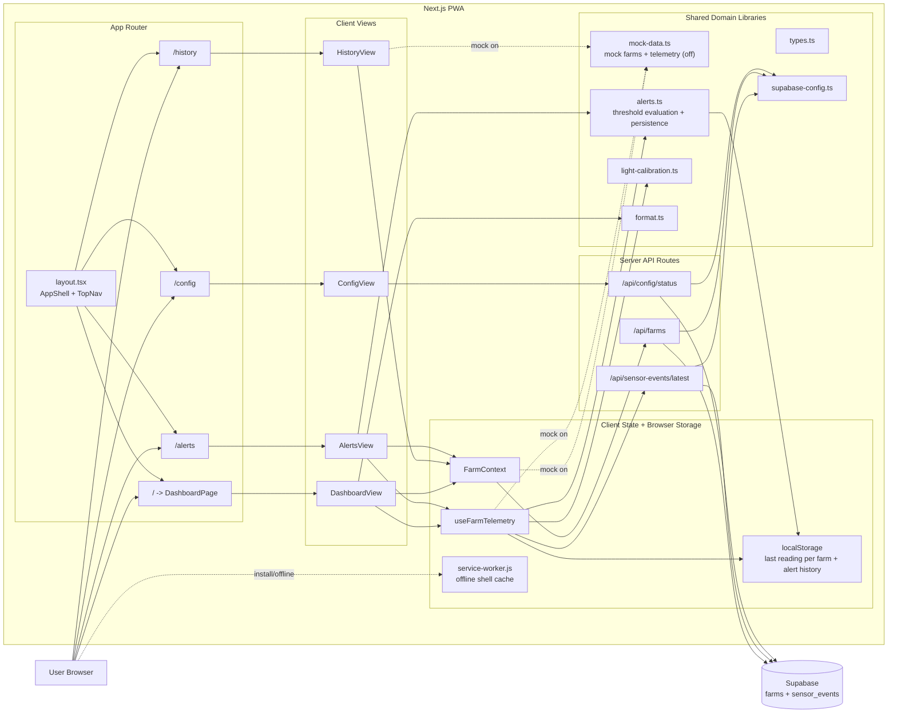
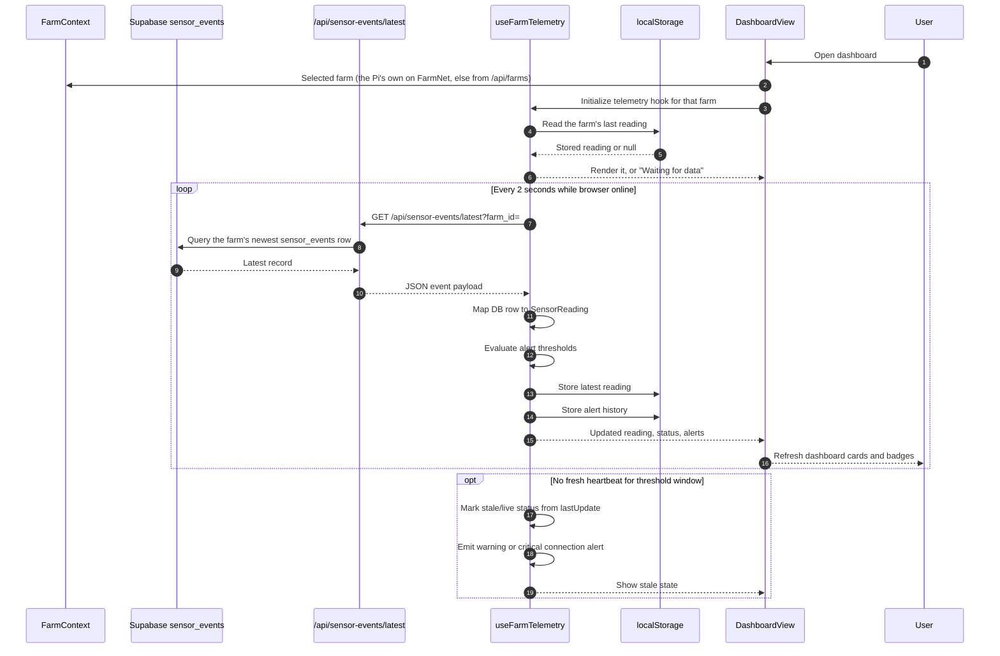

# VerdantOS UML

Mermaid diagrams below match current code shape in this repo.

The laptop serial bridge was retired in favour of the Pi's `shelf-bridge`
service, which publishes shelf readings over MQTT (`docs/shelf-sensors.md` at
the repo root). The Pi's Supabase bridge mirrors them into `sensor_events`
(`docs/SUPABASE-SETUP.md`).

## Component UML

## Sequence UML

